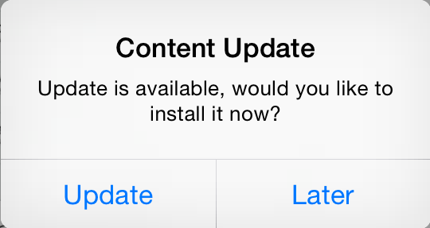
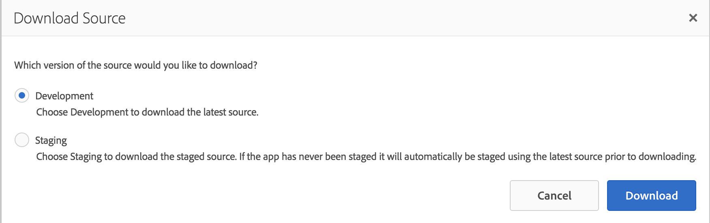

# Anatomy of PGE Hello World

This document describes the various pieces contained in the PGE Hello World application. It is focused on the elements which are *specific* to AEM Apps development.

## Top Level

As with AEM Apps PhoneGap applications created from the [Starter Kit](https://github.com/Adobe-Marketing-Cloud-Apps/aem-phonegap-starter-kit), the PGE Hello World app is split between `content-dev`, the content package containing developer-created content such as configuration, scripts, JavaScript, and CSS, and `content-author`, the content package containing authorable content. In a real-world case, `content-author` would only be installed during the initial application rollout. After this point, content authors will be responsible for updating this content.

## `content-dev`

The `content-dev` package contains three distinct content structures:

1. Components & Templates
2. Client Libraries and Design Settings
3. PhoneGap Application Shell

### Components & Templates

As with most AEM projects, PGE Hello World contains AEM Components and Templates in `/apps/COMPANY/PROJECT/components` and `/apps/COMPANY/PROJECT/templates`, in this case `/apps/justinedelson/helloworld/components` and `/apps/justinedelson/helloworld/templates` respectively. There are only two components in this project:

1. `/apps/justinedelson/helloworld/components/page/page` - a generic page component
2. `/apps/justinedelson/helloworld/components/page/splash-page` - a page component specific to the Splash Page of the application.

#### Splash Page

In a AEM Apps PhoneGap Enterprise application, the Splash Page is displayed on application load and is responsible for ensuring that the initial content of the application is moved to the proper location. By default, the content of a PhoneGap application is contained in a read-only area of the device's file system to a read-write area so that when the content is updated using Content Sync, it can be overwritten. Since the entire application is present in this read-write location, the update payloads from ContentSync only need to include the exact files that were affected by the update.

All of the integration code required to do this content move is provided in the `mobileapps/components/splash-page` page component and the `cq.mobile.content-sync` Client Library. The only reason for an application-specific Splash Page component is to provide a specific visual look. In this case, this Splash Page simply has a yellow background.

Since `mobileapps/components/splash-page` is implemented in JSP, the custom Splash Page component defines the included Client Library in `headlibs.jsp` and `bodylibs.jsp`. The referenced Client Library, in `/apps/justinedelson/helloworld/components/page/splash-page/clientlibs` has a single CSS file and embeds three existing Client Libraries:

* `angularjs` - although the PGE Hello World application does not use AngularJS, the Splash Page does.
* `cq.mobile.foundation.angular` - this library provides some basic utilities for integrating AngularJS with the AEM Apps framework.
* `cq.mobile.content-sync` - this library provides the JavaScript implementation of the Content Sync client.

#### Page Component

The generic page component is chiefly made of a single parsys (in the default content, this contains a single foundation Text component which says "Hello World", naturally). It does have four special bits related to AEM Apps.

##### `data-content-package-name`

The top-level `<html>` element includes a data attribute named `data-content-package-name`. This is needed by the JavaScript code to pull the appropriate content package. This attribute is set to the inherited value of the `phonegap-contentPackageName` property, defaulting to `en` if this property is not specified:

       data-content-package-name="${inheritedPageProperties['phonegap-contentPackageName'] || 'en'}"

This property will be set on the application's home screen, as seen below.

##### Update Button

In `body.html`, there is an HTML element to trigger an update check.

        <button id="pge-app-update">Check for Update</button>

In JavaScript, we attach an event handler for this element to start the update process. In a real application, you would be more likely to trigger this automatically on application launch.

##### Reference to `cordova.js`

The `body.html` also includes a dynamically generated `

##### Mobile Services State Tracking

The last special bit is some JavaScript code which calls the Adobe Mobile Service `trackState` function to track the application state when the page is loaded:

        document.addEventListener("deviceready", function() {
            if (ADB) {
                ADB.trackState("${properties['jcr:title'] @ context='scriptString'}")
            }
        }, false);

#### Configuration

The package contains a single configuration, `com.day.cq.wcm.mobile.core.impl.MobileEmulatorProvider-pgehello` which enables the Responsive Simulator for the Generic Page component described above.

### Client Libraries and Design Settings

The Client Library and Design Settings, in `/etc/clientlibs/justinedelson/helloworld/phonegap` and `/etc/designs/justinedelson/helloworld/phonegap` are standard AEM Client Library and Design Settings.

#### Update Button Handler

The one significant piece of JavaScript code is the click event handler for the Check for Update button described above. This script is initialized with the `CQ.mobile.contentUpdate` function as well as the global Zepto object, which is part of the `cq.mobile.content-sync` Client Library. The script first reads the `data-content-package-name` attribute on the root `html` element (see above) and calls the `contentUpdate` function to create a new instance of the Content Update object, called `contentUpdater`. It then registers a click handler for the button.

When the button is clicked, `contentUpdater.isContentPackageUpdateAvailable()` is called with the content package name retrieved from the `data-content-package-name` attribute. This function (as its name suggests) checks with the AEM publish environment to see if an updated version of the named content package is available. Based on the response, the function will call the provided callback function. If there is an update available, the user is prompted to install the update. This prompt is performed using the [Cordova Dialogs Plugin](https://github.com/apache/cordova-plugin-dialogs).

    contentUpdater.isContentPackageUpdateAvailable(contentPackageName,
        function callback(error, isUpdateAvailable) {
            // error handling code elided

            if (isUpdateAvailable) {
                // Confirm if the user would like to update now
                navigator.notification.confirm('Update is available, would you like to install it now?',
                    function onConfirm(buttonIndex) {
                      // dialog button handling elided
                    });
            }
        });

If an update is available and the user selects the appropriate button, `contentUpdater.updateContentPackageByName()` is called, again with the content package name. Assuming this update is successful, the current screen is reloaded:

    contentUpdater.updateContentPackageByName(contentPackageName,
        function callback(error, pathToContent) {
            // error handling code elided
            window.location.reload( true );
        });

In addition, during this update process, various events are passed to Adobe Mobile Services, e.g. when the user clicks the Check for Update button:

    if (window.ADB) {
        window.ADB.trackAction('CheckForUpdate');
    }

### PhoneGap Application Shell

The final element in the `content-dev` package is the content structure which defines the shell of the mobile application. The shell defines the wrapper of the application *into which* the authored content is displayed. It can be conceived of as the portion of the application which is **not** upgradable over the air -- changes to the shell require resubmission to the app store. The shell essentially does not have a visual element in that the only visual piece is the splash screen (described above) which in general would only be displayed to a user for a very brief window of time.

The application shell is represented by a single `cq:Page` node, at `/content/phonegap/helloworld/shell`. The contained `cq:PageContent` node has a number of properties. Most significantly:

* `sling:resourceType` - Set to `justinedelson/helloworld/components/page/splash-page` as described above.
* `pge-type` - Set to `[app-instance]` which specifies that this page as the application shell.
* `phonegap-build-exportTemplate` - Defines the Content Sync configuration which is used to generate the production version of the application, including both the shell and the currently staged version of the application's content. Set to `/content/phonegap/helloworld/shell/jcr:content/pge-app/helloworld`.
* `phonegap-build-exportTemplate-dev` - Defines the Content Sync configuration which is used to generate the development version of the application, including both the shell and a current snapshot of the application's content. Set to `/content/phonegap/helloworld/shell/jcr:content/pge-app/helloworld-dev`
* `phonegap-exportTemplate` - Set to `/content/phonegap/helloworld/shell/jcr:content/pge-app/app-config`. Defines the Content Sync configuration which is used to generate the *only* the application shell, i.e. without any initial content.
 
#### Content Sync Configuration

The most complex content within the shell is the content sync configurations. These configurations are used to export content from AEM to actually create the mobile application, either by downloading a ZIP file and running PhoneGap commands on the command line or by sending content to the PhoneGap Build cloud service. As seen above, there are actually two configurations: `/content/phonegap/helloworld/shell/jcr:content/pge-app/helloworld` is used for PhoneGap Build and for Staging source downloads. `/content/phonegap/helloworld/shell/jcr:content/pge-app/helloworld-dev` is used for Development source downloads.

While `/content/phonegap/helloworld/shell/jcr:content/pge-app/helloworld` and `/content/phonegap/helloworld/shell/jcr:content/pge-app/helloworld-dev` are very similar in this case, they do have different values for the `autoCreateFirstUpdateBeforeImport` and `autoFillBeforeImport` properties on the `en` and `shell` child nodes. For the production version, `autoCreateFirstUpdateBeforeImport` is set to `true`, meaning that when the application is built for the first time, a content package update will be created. In the development version, `autoFillBeforeImport` is set to `true`, meaning that the application will simply be populated with the current content set.

In addition, in more complex cases, there may be additional differences; for example, you may want to include different Adobe Mobile Services configurations or include additional debug content in the development version.

##### Top-Level Content Sync Configuration

This Content Sync configuration is used to generate a full application -- including both the application shell and the application's content.

To build the content sync export, AEM starts at `/content/phonegap/helloworld/shell/jcr:content/pge-app/helloworld` and iterates through the child nodes. Each of these defines a different Content Sync update handler which, as the name suggests, handles updating of some specific part of the content sync export. Specifically:

* `content-listing` - This is of type `mobilecontentlisting` and is responsible for creating the file `www/pge-package.json`. This file is optimize the file copy from the read-only to read-write storage discussed above. On many mobile devices, listing directory contents comes with a non-trivial performance penalty; as such, listing the files explicitly here can speed up that copy process significantly.
* `en` - This is of type `contentsyncconfigcontent` and results in the Content Sync configuration at `/content/phonegap/helloworld/en/jcr:content/pge-app/app-config` (which contains the actual application content) being exported and copied into this export. This configuration will be described in the `content-author` section below.
* `shell` - This is of type `contentsyncconfigcontent` and results in the Content Sync configuration at `/content/phonegap/helloworld/shell/jcr:content/pge-app/app-config` (which contains the actual application content) being exported and copied into this export.

##### Shell Content Sync Configuration

This Content Sync configuration is used to generate the application shell.

The `/content/phonegap/helloworld/shell/jcr:content/pge-app/app-config` has the following handler configurations:

* `ams-ADBMobileConfig` - This is of type `mobileADBMobileConfigJSON` and is responsible for exporting the Adobe Mobile Services JSON configuration.
* `content-listing` - This is of type `mobilecontentlisting` and is responsible for creating the file `www/pge-package.json`. As above, this is a performance optimization.
* `content-packages-listing` - This is of type `mobilecontentpackageslisting` and is responsible for creating the file `www/pge-content-packages.json` and is used by the JavaScript content update code called above to determine what content packages are available. Specifically, when the `en` content package name passed to `contentUpdater.isContentPackageUpdateAvailable()`, this JSON object is used to resolve that name into a path.
* `phonegap-static-files` - This is of type `copy` and copies the files from `/content/phonegap/helloworld/shell/jcr:content/pge-app/app-content/phonegap` to the export.
* `splash-screen` - This is of type `mobileapprootpage` and exports the page at `/content/phonegap/helloworld/shell` (specified using the relative path `../../../..`).
* `splash-screen-clientlib` - This is of type `clientlib` and exports the Client Library at `/apps/justinedelson/helloworld/components/page/splash-page/clientlibs`. The `splash-page` Client Library has been separated from the Application's Client Library to ensure it is only loading the bare minimum JavaScript code to ensure that the application initializes as quickly as possible.

##### PhoneGap Static Files

There are three files in the `/content/phonegap/helloworld/shell/jcr:content/pge-app/app-content/phonegap` folder which get copied into the Content Sync export:

* `.cordova/config.json` - This file provides some application metadata for use with PhoneGap Build.
* `www/config.xml` - This is the central Cordova configuration file. It defines various Cordova preferences and the list of Cordova plugins used by the application.
* `www/index.html` - When building a Cordova application from the command line, the `content` element in the `config.xml` file is used to determine the entry point for the application. However, when building the application using PhoneGap Build, the entry point is *always* `www/index.html`. As such, we need this file, which simply redirects to the proper location, specifically for PhoneGap Build.

##### Cordova Plugins

One of the items contained in the `config.xml` file is the list of Cordova Plugins used by the application. When the Cordova (or PhoneGap) Command Line tool is run, it will automatically download these plugins from NPM into the `plugins` directory. It is also possible to add plugins directly to the `plugins` directory. However, only listing them in the `config.xml` file has the advantage of keeping your source code smaller.

When specifying a Cordova plugin in the `config.xml` file, you can provide either a specific version number, in which case that exact version will be used, or a version range specifier, which could result in a higher version to be used if it is available and matches the range. In this case, a specific version is referenced. It is also possible to reference a Git URL, which is necessary if a plugin is not available through NPM, which is currently the case for the Adobe Mobile Service plugin.

For the purpose of this simple application, the following plugins are necessary:

    <plugin name="ADBMobile" spec="https://github.com/Adobe-Marketing-Cloud/mobile-services#2e32d30badba8791cef8f58646244c807728edd8" />
    <plugin name="cordova-plugin-file" spec="2.1.0" />
    <plugin name="cordova-plugin-file-transfer" spec="1.2.1"/>
    <plugin name="cordova-plugin-whitelist" spec="1.0.0" />
    <plugin name="cordova-plugin-dialogs" spec="1.1.1"/>
    <plugin name="org.chromium.zip" spec="2.1.0"/>

###### `ADBMobile`

The `ABDMobile` plugin is a Cordova wrapper around the native Adobe Mobile Services SDK. In this case, it is responsible for sending analytics signals to Adobe Mobile Services and receiving In-App Messages.

More information can be found at [https://marketing.adobe.com/resources/help/en_US/mobile/ios/phonegap_methods.html](https://marketing.adobe.com/resources/help/en_US/mobile/ios/phonegap_methods.html).

###### `cordova-plugin-file`

The `cordova-plugin-file` plugin provides an API to access the device's filesystem. It is used by both the application initialization and Content Sync processes to write files to the application's read-write data area.

More information can be found at [https://github.com/apache/cordova-plugin-file](https://github.com/apache/cordova-plugin-file).

###### `cordova-plugin-file-transfer`

The `cordova-plugin-file-transfer` plugin provides an API to transfer files over HTTP. It is used by the Content Sync process to download the Content Sync package.

More information can be found at [https://github.com/apache/cordova-plugin-file-transfer](https://github.com/apache/cordova-plugin-file-transfer).

###### `cordova-plugin-whitelist`

The `cordova-plugin-whitelist` plugin provides a security policy for the embedded WebView used by Cordova/Phonegap.

More information can be found at [https://github.com/apache/cordova-plugin-whitelist](https://github.com/apache/cordova-plugin-whitelist).

###### `cordova-plugin-dialogs`

The `cordova-plugin-dialogs` plugin provides an API for showing native dialogs. It is used as part of the update checking process.

More information can be found at [https://github.com/apache/cordova-plugin-dialogs](https://github.com/apache/cordova-plugin-dialogs).

###### `org.chromium.zip`

The `org.chromium.zip` plugin, as the name suggests, provides an API for unzipping ZIP archives. It is used by the Content Sync process to unzip the downloaded Content Sync file.

More information can be found at [https://github.com/MobileChromeApps/cordova-plugin-zip](https://github.com/MobileChromeApps/cordova-plugin-zip).

## `content-author`

The `content-author` package is essentially the "seed" content used to populate the initial set of authorable content. In this case, it includes a two `cq:Page`s -- the Splash Page and the Home Page, containing some Hello World text. It also includes the content sync configuration.

It is important to note that although in this particular example, `content-dev` and `content-author` are in the *same* source control repository, in practice, this would not be the case. Once this package is installed and business users have started to author content, this package wouldn't generally be changed.

### Pages

In AEM Apps just as in AEM Sites, `cq:Page` nodes are used to contain the content for different "pages"; the difference is that in a mobile application, these "pages" may actually represent "screens" in a single-page application.

> However, truth be told, this is also a possibility in a Sites project as well if you are building a single-page web application.

#### Splash Page

The splash page, at `/content/phonegap/helloworld/en`, uses the splash page component described above. It also contains, in its `jcr:content/pge-app` child node, the authorable content content sync configuration, described below. This page generally wouldn't be edited by an author, but certainly could be. Similar to `/content/phonegap/helloworld/shell`, described above, it has the special `pge-type` property indicating that it is the root of an application content structure. In this case, the property's value is `app-content` indicating that it is an application content structure.

#### Home Page

The home page, at `/content/phonegap/helloworld/en/home`, is the "single page" in this single-page application. In this seed content, it just has a single Text component saying "Hello World".

### Authorable Content Content Sync Configuration

The Content Sync configurations at `/content/phonegap/helloworld/en/jcr:content/pge-app/app-config` and `/content/phonegap/helloworld/en/jcr:content/pge-app/app-config-dev` define the set of content which can be updated over the air. In this case, these configurations are identical, although as stated above, in more complex cases, they could differ to include different content where necessary.

This configuration consists of the following Content Sync handlers:

* `assets` - this is of type `mobilepageassets` and is responsible for extracting all referenced assets and placing them in the content sync package. By default, this handler supports any component which extends the Foundation Image component, but this is configurable.
* `clientlibs-all` - This is of type `clientlib` and exports the Client Library at `/etc/clientlibs/justinedelson/helloworld/phonegap/clientlibsall`. While this Client Library isn't "authorable", placing it in this package allows for it to be updated over the air. Thus, when we change the CSS, the application doesn't need to be resubmitted to the app store.
* `content-listing` - This is of type `mobilecontentlisting` and is responsible for creating the file `www/pge-package.json`. As above, this is a performance optimization.
* `pages` - this is of type `mobileapppages` and is responsible for extracting all of the pages, starting from `/content/phonegap/helloworld/en/home` (specified using a relative path so that if you copy and paste this configuration elsewhere it would still work). Note the `parameters` child node which causes a query parameter (`appExport=true`) to be passed into all requests issued by the Content Sync handler. This allows components to render different HTML in the authoring environment from that which is delivered to the mobile application. The PhoneGap Image component (`/libs/mobileapps/components/image`) is an example of such a component.